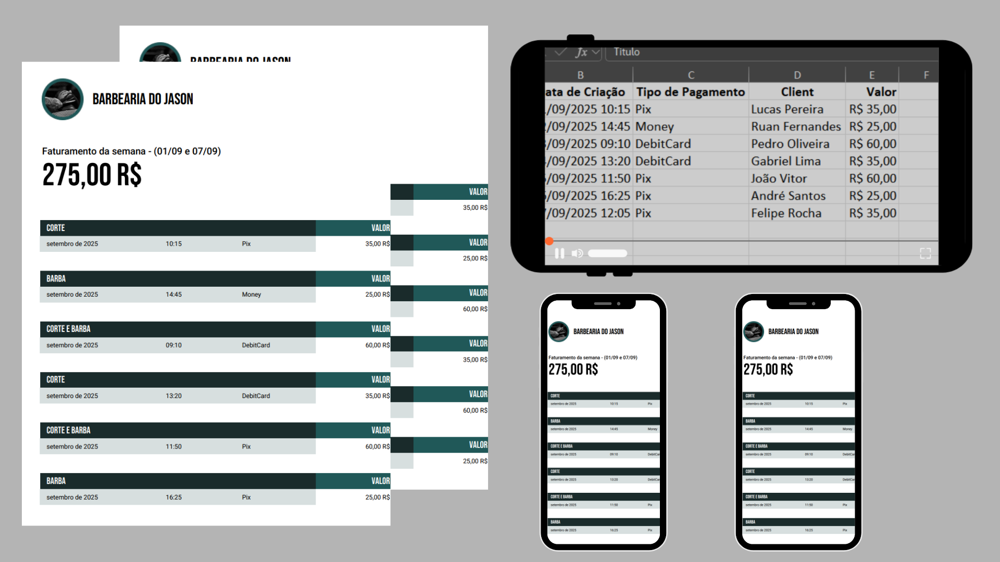

## 💈 BarberBoss


API desenvolvida em **.NET 8**, seguindo os princípios de **DDD (Domain-Driven Design)** para oferecer uma solução sólida, organizada e escalável voltada ao gerenciamento de faturamento de uma barbearia.
__________________________________________________________________________________________________________________________________

### 🧩 Sobre o projeto

O principal objetivo da API é registrar e controlar os **faturamentos semanais**, detalhando informações como:

- Nome do profissional.

- Serviço prestado.

- Nome do cliente.

- Valor do serviço.

- Tipo de pagamento.

Todos os dados são persistidos de forma segura e eficiente através do **Entity Framework Core (EF Core)** com o **MySQL** como banco de dados principal.




__________________________________________________________________________________________________________________________________

### ⚙️ Arquitetura e boas práticas

A aplicação foi construída com base em **DDD**, respeitando a separação clara de responsabilidades em camadas.
A arquitetura segue os **princípios SOLID**, **aplicando injeção de dependência**, uso de **Scrutor** para registrar serviços automaticamente, e uma estrutura limpa e escalável.

A API segue o padrão **REST**, utilizando os **métodos HTTP** adequados para cada operação e garantindo uma comunicação clara entre **cliente e servidor**.

A documentação interativa é feita com **Swagger**, permitindo fácil visualização, teste e entendimento das rotas disponíveis.
__________________________________________________________________________________________________________________________________

### 📦 Tecnologias e pacotes utilizados

- .NET 8.

- Entity Framework Core – **ORM para persistência e acesso aos dados**.

- MySQL – Banco de dados relacional.

- Mapster – **Mapeamento entre objetos** com performance e código limpo.

- FluentValidation – **Validação** fluente e legível dos modelos.

- Scrutor – **Registro automático de dependências** via Reflection.

- Swagger / Swashbuckle – **Documentação e testes de endpoints**.

- Custom Error Handling – Tratamento centralizado e **seguro de erros**.
__________________________________________________________________________________________________________________________________

### 🚀 Riquisitos do projeto

- visual Studio 2022 + ou Visual Studio Code.
- Windows 10+ ou Linux/MacOS com [.NET SDK](https://dotnet.microsoft.com/pt-br/download/dotnet/8.0) instalado.
- [MySQL](https://www.mysql.com/) Server intalado.
__________________________________________________________________________________________________________________________________

## Instalação

1. Clone o repositório:
  ```sh
  git clone https://github.com/OlympioKaue/barberBoss.git
  ```
2. Preencha as informações no arquivo ``appsettings.example.json``
3. Execute a API.
4. Aproveite o teste.

